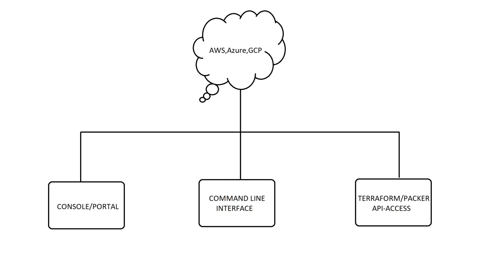
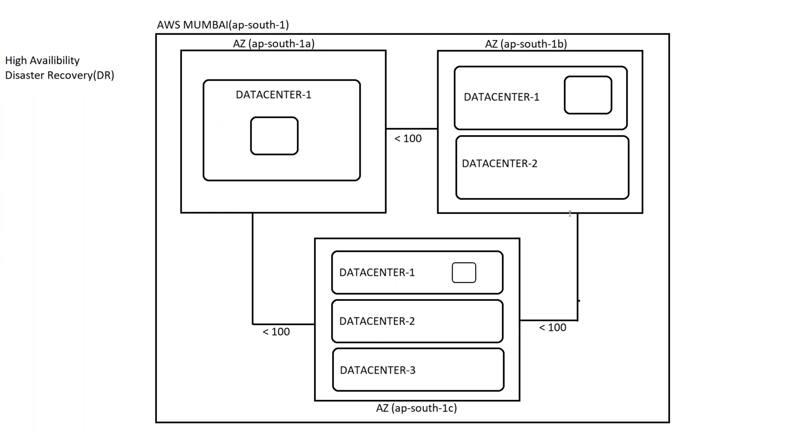
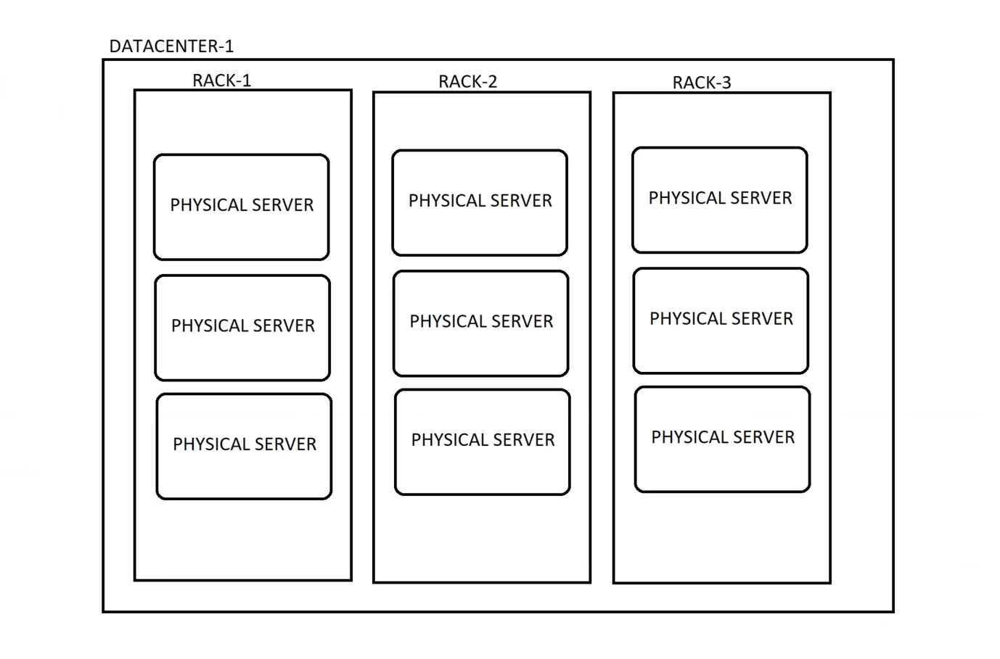
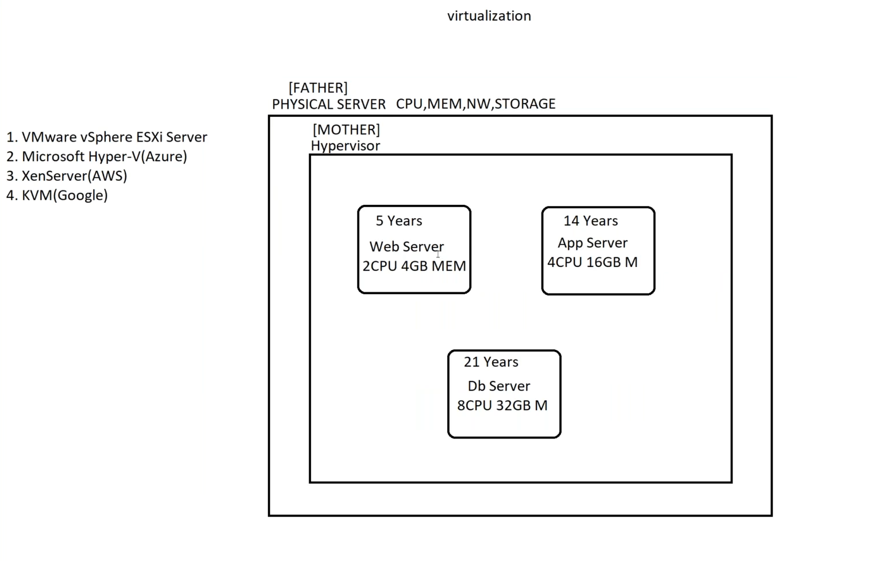

# AWS Basics Agenda

## 1. Understanding the AWS Console
- Overview of the AWS Management Console
- Navigation tips and best practices
- Accessing services and managing resources

---

## 2. AWS Infrastructure Hierarchy

### 🌍 Regions → 🏙 Availability Zones (AZs) → 🏢 Data Centers

- **Regions**: Geographical areas containing multiple, isolated locations known as Availability Zones.
- **Availability Zones (AZs)**: One or more discrete data centers with redundant power, networking, and connectivity.
- **Data Centers**: Physical facilities housing the infrastructure for cloud services.

---

> 🟢 **As of now:**
> - **48** Launched AWS Regions
> - **104** Availability Zones (AZs)

---

