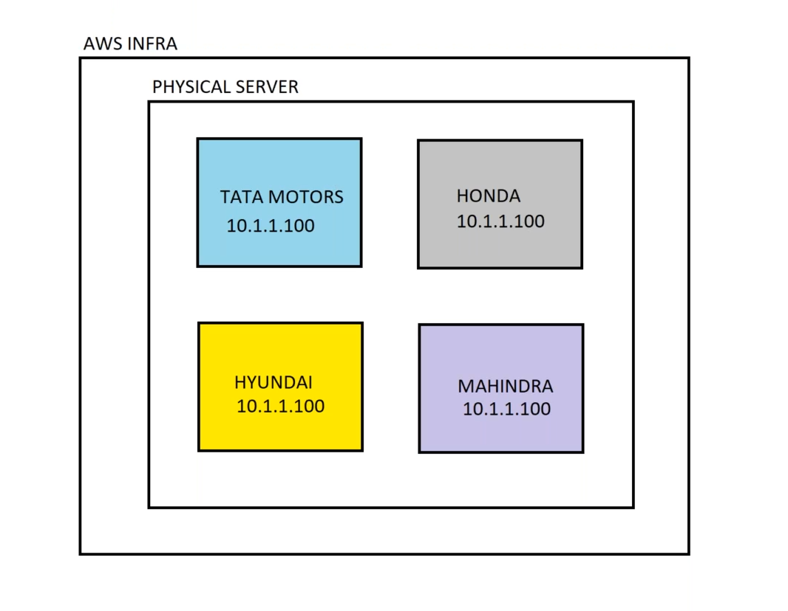
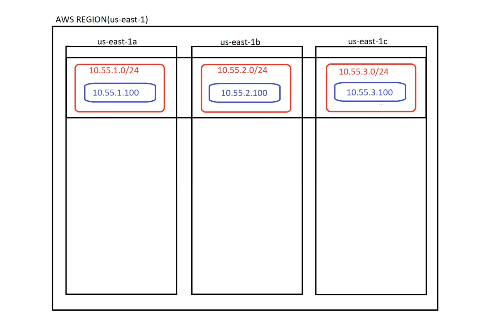
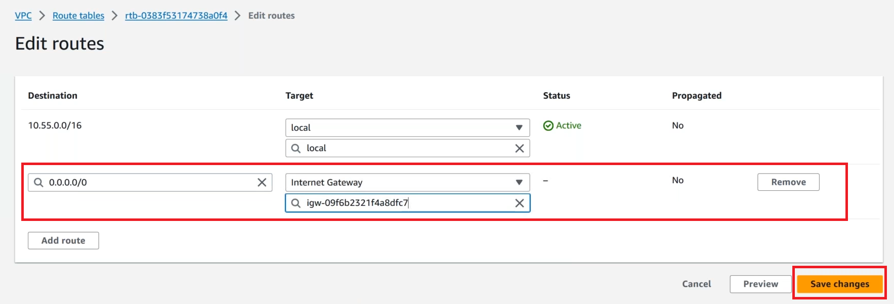

# ☁️ AWS Networking & VPC Lab Guide

---

## 🗂 Agenda

1. [IP Addressing Overview](#1-ip-addressing-overview)  
2. [Understanding VPC](#2-understanding-vpc)  
3. [Deploying VPC in Depth](#3-deploying-vpc-in-depth-lab)

---

## ❓ Why Do We Need IP Addressing & VPC?

> IP Addressing and VPCs are essential for securely organizing and connecting cloud resources.



---

## 1. 🌐 IP Addressing Overview

### 📌 What is IP Addressing?

- IP addressing is how servers **communicate** with one another.
- Every device in a network uses an **IP address** to send and receive data.

---

### 🧠 Types of IP Addressing

- **IPv4** – Commonly used today (e.g., `192.168.1.1`)
- **IPv6** – Newer, supports more devices

---

### 🧮 IPv4 Address Structure

- IP range: `0.0.0.0` to `255.255.255.255`
- Divided into 5 classes (A to E)

| Class | Range                       | Private IP Range                     | Notes                           |
|-------|-----------------------------|--------------------------------------|----------------------------------|
| A     | `1.0.0.0` – `126.255.255.255` | `10.0.0.0` – `10.255.255.255`       | Large networks                   |
| B     | `128.0.0.0` – `191.255.255.255` | `172.16.0.0` – `172.31.255.255`   | Medium networks                  |
| C     | `192.0.0.0` – `223.255.255.255` | `192.168.0.0` – `192.168.255.255` | Small/home networks              |
| D     | `224.0.0.0` – `239.255.255.255` | *N/A*                              | Used for multicast (not private) |
| E     | `240.0.0.0` – `255.255.255.255` | *N/A*                              | Reserved for research            |

> ⚠️ **Note:** `127.x.x.x` is reserved for **Loopback** (localhost).

---

### ✅ Commonly Used Private IP Ranges

- `10.0.0.0/8`  
- `172.16.0.0/12`  
- `192.168.0.0/16`

> 🧑‍💻 In most real-world scenarios, **only private IPs** are used inside a VPC.

---

## 2. 🛡 Understanding VPC (Virtual Private Cloud)

A **VPC** is a logically isolated section of the AWS cloud where you can launch AWS resources in a virtual network.

---

## 3. 🚀 Deploying VPC in Depth (Lab)

---

### 🧪 Step 1: Create VPC

> VPC with IP range `10.55.0.0/16` in region `us-east-1`

1. Go to **VPC service** on AWS Console  
2. Select **VPC Only** under *Create VPC*  
3. Provide:
   - Name for VPC  
   - IPv4 CIDR block: `10.55.0.0/16`  
4. Click **Create VPC**

> 📝 Note: VPCs are global but associated with a specific region.

---

### 🧪 Step 2: Create Subnets

Subnets:
- `10.55.1.0/24` → AZ: `us-east-1a`
- `10.55.2.0/24` → AZ: `us-east-1b`
- `10.55.3.0/24` → AZ: `us-east-1c`

1. Navigate to **Subnets** → Click **Create Subnet**
2. Select your VPC
3. Name the subnet
4. Choose AZ and set CIDR block
5. Repeat for all 3 subnets

---

### 🧪 Step 3: Enable Auto-Assign Public IP

> Allows EC2 instances to automatically get public IPs

1. Select a subnet  
2. Go to **Actions → Edit Subnet Settings**  
3. Check ✅ **Auto-assign public IPv4 address**
4. Repeat for all subnets

---

### 🧪 Step 4: Enable DNS Hostnames

1. Select the VPC  
2. Go to **Actions → Edit VPC Settings**
3. Check ✅ **Enable DNS Hostnames**



---

### 🧪 Step 5: Create Internet Gateway (IGW)

> Required for internet access

1. Navigate to **Internet Gateways**
2. Click **Create Internet Gateway**
3. Name it and attach it to your VPC

---

### 🧪 Step 6: Create and Configure Route Table

> Think of route tables as "road signs" for your network


1. Go to **Route Tables → Create Route Table**
2. Assign it to your VPC
3. Set as **Main = Yes**, disable default as main
4. Go to **Subnet Associations → Edit**  
   - Select all subnets  
5. Add route:
   - Destination: `0.0.0.0/0`
   - Target: Internet Gateway (IGW)



> 💬 **Note:** This route says: “Any traffic that’s not part of the `10.55.0.0/16` range → Go to the internet.”

---

### 🧪 Step 7: Launch a Linux EC2 Instance

1. Go to **EC2 → Launch Instance**
2. Choose Amazon Linux AMI
3. Create or choose:
   - Security Group (SG)  
   - Key Pair (for SSH access)
4. Select one of your subnets

---

### 🧪 Step 8: Connect to the Linux Server

> Use the Key Pair you downloaded to connect

```bash
ssh -i "your-key.pem" ec2-user@<EC2-public-IP>
```

---

## ✅ You’ve Successfully Built a VPC with Public Subnets and Internet Access!