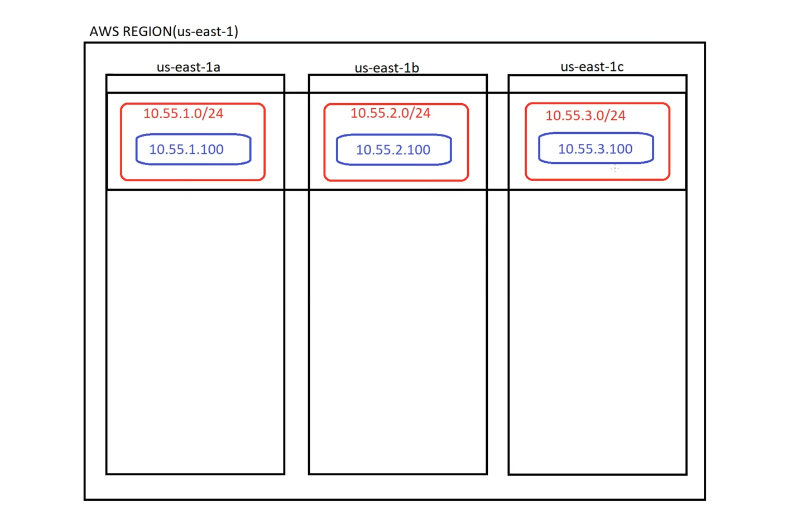

Agenda:
1. IP Addressing Overview
2. Understanding VPC
3. Deploying VPC in depth.

---
Why we need IP Addressing and VPC..?

1. IP Addressing
---------------
* it is used to communicate servers each other, If one server wants to communicate with anohter server we can use this IP's
* There are two types of IP Addressing
    * IPv4 ( We still using this )
    * IPV6

IPv4:
------
* All IPv4 ranges are comes under 0.0.0.0 to 255.255.255.255

* There are 5 types of classes in IPv4

Class A : 1.0.0.0 to 126.255.255.255 \
Private IP Range : 10.0.0.0 to 10.255.255.255

NOTE : 127.X.X.X is for Loopback Range

Class B : 128.0.0.0 to 191.255.255.255 \
Private IP Range : 172.16.0.0 to 172.31.255.255

Class C : 192.0.0.0 to 223.255.255.255 \
Private IP Range : 192.168.0.0 to 192.168.255.255

-------------------------------------------------
WE DONT USE BELOW CLASSES 
------------------------------------------------
Class D : 224.0.0.0 to 239.255.255.255

Class E : 240.0.0.0 to 255.255.255.255

IN OUR DAILY LIFE WE ONLY USE PRIVATE IP's
--------------------------------------------
Private IP Range : 10.0.0.0 to 10.255.255.255
Private IP Range : 172.16.0.0 to 172.31.255.255
Private IP Range : 192.168.0.0 to 192.168.255.255

---

## Understanding VPC ( Virtual Private Cloud )
1. Create VPC with IP Range 10.55.0.0/16 in region us-east-1.
2. Create subnets 1 2 3 with range 10.55.1.0/24, 10.55.2.0/24, 10.55.3.0/24
3. Enable public IP on Subnets
4. Enable DNS Hostnames on VPC.
5. Create an Internet Gateway ( IGW ) and attach it to VPC
6. Create routing table and add subnets to it, Add routs to routing table.
7. Create a linux server and create SG and KeyPair while creating it.
8. Connect to Linux Server.

Lab for above task 
-----------------

### Step - 1 -> Create VPC with IP Range 10.55.0.0/16 in region us-east-1

* Goto VPC service in AWS portal
* Select VPC Only on Resource to create section
    * Give name for VPC
    * Give IPv4 CIDR ex : 10.55.0.0/16
* Click on Create

__Note : VPC which we had create that is not created in any region, It is just created that it.__

---

### Step - 2 -> Create subnets 1 2 3 with range 10.55.1.0/24, 10.55.2.0/24, 10.55.3.0/24

* Create Subnets 1 now
    * Goto Subnet and click on Create Subnet
    * Select the VPC first, It refers in which VPC you want to create your subnet
    * Give the Subnet 1 name
    * Select Availablity Zone
    * Select VPC CIDR Block
    * Enter the Subnet Range Ex : 10.55.1.0/24
* Click on Create
* Follow the same process to create another two subnets
* But create subnet 2 in 1b AZ and Subnet 3 in 1c AZ

---

### Step - 3 -> Enable public IP on Subnets

* Enable public IP on Subnet, So that when you are using subnet to create any EC2, Public IP will be auto assigned
    * To do that, follow below steps
    * Select subnet 1
    * Click on __Action__, CLick on __Edit Subnet settings__
    * Click the Check box option called __Enable auto-assign public IPv4 address__ in __Auto-Assign IP Settings__
    * Follow same process for Subnet 2 and Subnet 3  

---

### Step - 4 -> Enable DNS Hostnames on VPC
* Select the VPC
    * Edit VPC settings
    * Click on check box, __Enable DNS hostname__ on DNS Settings

---

### Step - 5 -> Create an Internet Gateway ( IGW ) and attach it to VPC
* Internet Gateway is use to give access for servers to connect to internet
* To create IGW, Click on create
* Give the name, and Select VPC

---

### Step - 6 -> Create routing table and add subnets to it

* In the above image if we want to goto Bengaluru, Sign board will show you the way to reach the destination, in same way route table will show the way for traffic, if user want to goto web server, Route table will send traffic to Web servers.

* Not to create RT, Click on create RT
    * Give Name for RT
    * Select VPC
    * By Default when we are creating VPC, One RT will be created, So we need to nake default RT Main = No, We need you make newly create RT Main = Yes
    * To add Subnets to RT
        * Select RT, Click on Edit Subnet Associations
        * Select the Subnets, Click on Save Association
    * Now to semd the traffic from server to out side, We need to send it throw IGW
        * To do that Select RT, select __Rout__ in bottom
        * Edit the Route and add route as shown in below

__NOTE : Here fmro above image, We see thay 10.55.0.0/16 destination right.
Here apart from 10.55.0.0/16 all the traffic need to go throw internetGate way__

---

### step - 7 -> Create a linux server and create SG and KeyPair while creating it.

---

### step - 8 -> Connect to Linux Server.
* Use SSH to connect to Linux Server