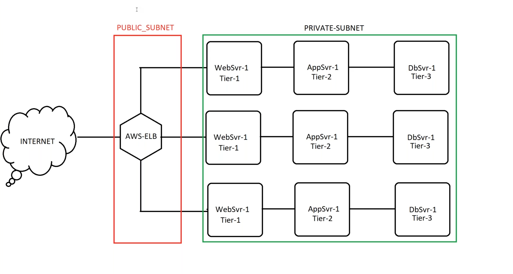
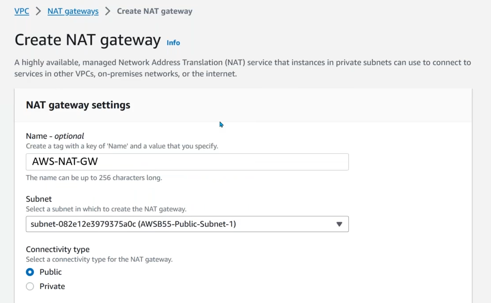

# 📘 AWS Networking Lab: Public & Private Subnets with NAT Gateway

## 🗂 Agenda
1. Understanding Public & Private Subnets
2. Elastic IP and NAT Gateway
3. Real-Time Use of Public & Private Subnets

---

## 🌐 What is a Public Subnet?


> A subnet is considered **public** when it is associated with a Route Table that has a route to the **Internet Gateway (IGW)**. This allows resources within that subnet to communicate with the internet directly.

---

## 🔒 What is a Private Subnet?


> A subnet is considered **private** if it has no direct access to the internet (i.e., no route to an IGW). We ensure this by associating the subnet with a **custom route table** that excludes any route to the IGW.

### 🛠 Steps to Create a Private Subnet:
1. Create a subnet.
2. Create a new Route Table (RT).
3. Associate the subnet to the new RT.

---

## 🧭 When to Use Public vs. Private Subnets



| Use Case                        | Public Subnet                    | Private Subnet                  |
|-------------------------------|----------------------------------|----------------------------------|
| Load Balancer   | ✅ Yes                           | ❌ No                            |
| App/DB Servers (internal use) | ❌ No                            | ✅ Yes                           |
| External Internet Access      | ✅ Direct                        | ➖ Via NAT Gateway               |

---

## 🖥️ Deploy EC2 Instances

- **Public Subnet 1**: Create an EC2 instance.
- **Private Subnet 1**: Create an EC2 instance with a fixed IP like `10.55.10.100`.
- **Private Subnet 2**: Create another EC2 instance with IP `10.55.20.100`.

### 📝 Note:
- While launching EC2 in private subnets, **disable Auto-assign Public IP**.
- Use only **Private IPs** – avoid using Public IPs in real-world internal networks.

---

## ❗ Problem with Private Subnets

Private instances **cannot access the internet**, meaning you can't:
- Install packages (e.g., `yum`, `apt`)
- Download tools or updates

---

## 🛠️ Fix: Setup NAT Gateway



- **Elastic IP (EIP)** is **mandatory** for NAT Gateway.
- NAT Gateway **must be placed in a public subnet**.
- Update the **private route table**:
  ```
  Destination: 0.0.0.0/0 -> Target: NAT Gateway
  ```


### ✅ Checklist:
- [ ] Add NAT Gateway in Public Subnet.
- [ ] Allocate and associate an Elastic IP.
- [ ] Update private subnet route table.
- [ ] Open required traffic in **Security Groups**.

---

## 🌍 Users Across the World? Use a Load Balancer


### 🧱 Architecture:
1. Deploy **Application Load Balancer (ALB)** in Public Subnets.
2. Create a **Target Group** with Private Subnet EC2s.
3. In ALB settings:
   - Select VPC and only **Public Subnets** in mappings.
   - Attach **Security Group** allowing HTTP/HTTPS or custom ports.
   - Route requests via **Listeners** to your **Target Group**.

---

## 🧹 Cleanup Instructions

Make sure to delete all AWS resources to avoid unwanted billing:

1. 🗑 Delete **NAT Gateway** (to release Elastic IP).
2. 🗑 Delete **Load Balancer**.
3. 🗑 Delete all **EC2 Instances**.
4. 🗑 Release **Elastic IP**.
5. 🗑 Delete any unused **EBS Volumes**.

---

## 💡 Best Practices & Tips

- 🔐 **Never expose your database servers** or internal apps directly to the internet.
- 🔁 **Use Auto Scaling** and ELB to handle traffic spikes securely.
- 📊 **Monitor NAT Gateway traffic** to optimize costs.
- 🔍 **Use Network ACLs and Security Groups** together for fine-grained control.
- 📦 Use **S3 VPC Endpoints** to allow private subnets to access S3 without NAT.
