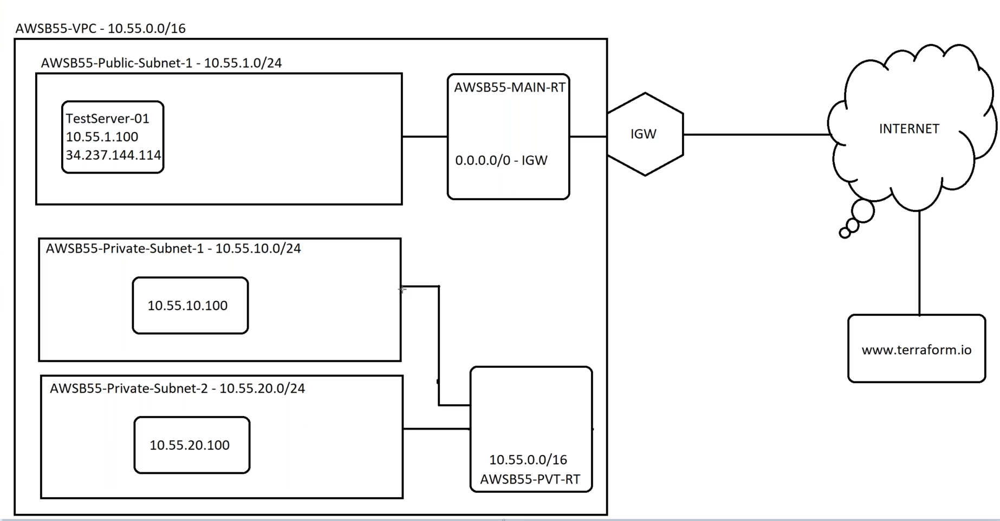

Ageda:
1. Public & Private Subnets
2. Elastic IP, NAT GW
3. How public and private subnet is using in realtime

## About Public Subnet

* From the above image since the subnet is connected to IGW, it called as public subnet

## Where to use Public and Private Subnet

## About Private Subnet
* TO make our subnet private, we need to create a new RT, so that it won't reachable for internet

* Follow below image for reference

* Steps to create private sunet
    * Create a subnet
    * Create a new RT
    * add the associate subnets to new RT

## Create servers on Public and Private subnets
* Create a EC2 instance on Public Subnet 1 
* Create a EC2 instance on Private Subnet 1
* Create a EC2 instance on Private Subnet 2
* Noe check the connectivity between machines

### Note
* While create instance in private subnet, Make sure you disable __auto-assign Public IP__, You can see this option on Advanced options while creating EC2
* And Manully enter Primary IP EX : 10.55.10.100 for Private Subnet 1 and for Private Subnet 2 give 10.55.20.100
* In real life we don't use Public IP's, We will use only private IP's

## Problem with Private Subnets
* If you want to install any packages or donwload any tools, we con't do it as the servers in private subnet won't exposed to internet
* To install the packages or tools, we will create a __NAT GW__ and we need to attach NAT GW to Public Subnet, Refer below image to attach NAT GW to Public IP

* Elastic IP is must for __NAT GW__
* Make sure you allow traffic from Security Group, otherwise we con't install packages on private machines
* Make sure you allow traffic from Private Route Table also, Follow below example \
EX : 0.0.0.0/0 -> NAT GW

## What if we have users from all over the world, then we follow below approch
* Deploy __LB__ On Public Servers
    * Create a Target Group and add two private servers to it
    * Now Create a Load Balencer, Which is an ALB ( Application Load Balencer )
    * Select our __VPC__ in __Network Mapping__
    * select the public Subnets only on __Mappings__
    * Select Security Group ( SG ), Allow All Traffic
    * Next select __Target Group__ on __Listeners and routing__
    * Create on Create LB

---
Remember to delete Lab
---
* Delete __NAT GW__ First
* Delete __LB__
* Delete Servers ( EC2 Instances )
* Delete Elastic IP
* Delete EBS Volumes