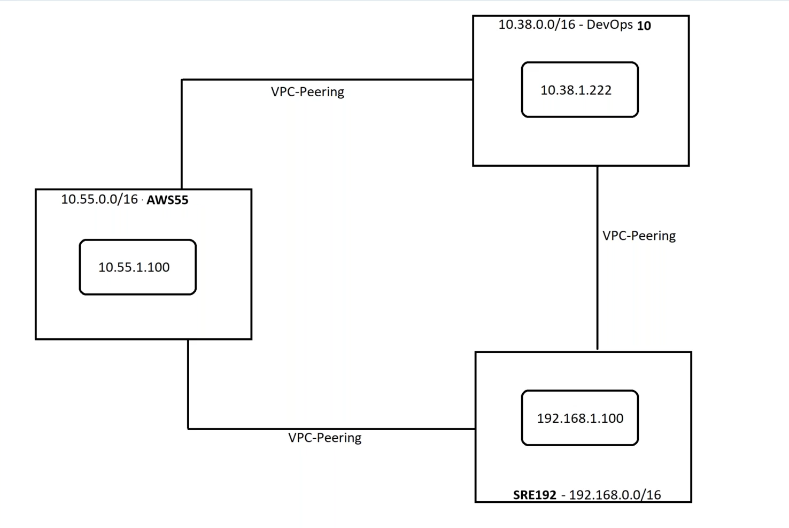

Agenda:
---
1. Flow Logs - To capture traffic on VPC's
2. VPC Peering

## Flow Logs
* we can apply this Flowlogs on three levels
    * VPC Level
    * Subnet Level
    * Interface Level
* If we apply Flowlogs on VPC Level, that means we are storing the logs on that entire VPC, means what it will store logs from VPC, Subnets under that VPC and service logs in that VPC will be logged

* To Save logs we have two options
    * S3 Bucket
    * CloudWatch Logs

## Lab starts : To store VPC Level logs into S3
* Create an S3 Bucket ( S3 Bucket name should be unique around the world )
* Create two buckets for future use
    * One is for fully qualified domain
    * One for Naked domain
* Now to to store logs in S3
    * Goto VPC
    * Click on __Flowlogs__
    * Give name
    * Select types of logs to store Ex : All
    * Select __Maximum aggrigation intervel__ Ex : 1 min
    * Destination : Select S3
    * And Give the ARN of S3 bucket
    * ARN you can find it on S3 bucket properties
    * Click on create Flowlog
* Now since we had enabled Flowlogs on VPC level, What ever subnets or services are there in that VPC, this Flowlog will be attached to that subnets and services, means all the data is gatherd.
* Ex : Check subnets of that VPC

---

## VPC Peering
* By default there is no connection between VPC's
* But we can achive this using VPC Peering
* While doing VPC peering there is two major rules we should follow
    * VPC's which want to have peering must not have same IP Range
    * VPC Peering don't support transit.

## VPC Peering Lab

* Create Three VPC's with Three Subnets each
* Create 1 EC2 instance on each VPC, In our case we need to create 3 VM's means VPC-1 containes 1 EC2 Instance and VPC-2 containes 1 EC2 Instance and VPC-3 containes 1 EC2 Instance
* Now try to ping each other ( Expected Issue : Ping wont happend as peering is not established )

*  Not to establish connection between VPC-1 to VPC-2
    * Goto Peering Connections in VPC
    * Click one create peering connection
    * Give name and select VPC-1 on __Select a local VPC to peer with__
    * Now on __Select another VPC to peer with__, Under __Account__ select __My Account__, and then select VPC-2
    * Click on __creare peering__
    * If you see after creating created peering will be on __Pending State__, To get status as __Active__, Click on __Actions__ and Select __Accept Request__ 
    * Since you had created a peering connection, ping wont work, When you try to ping to VPC-1 server to VPC-2 server, We need to edit Routing table for VPC-1 and VPC-2.
    
## NOTE  
* Establishing Peering is free, but when the data Transwer is happening aws will charge for that

## Missed to discuss on last video
* __Network Interface__ : It is like an internet drivers for AWS, almost every services have this Network Interface, It is more like an WIFI for aws services 