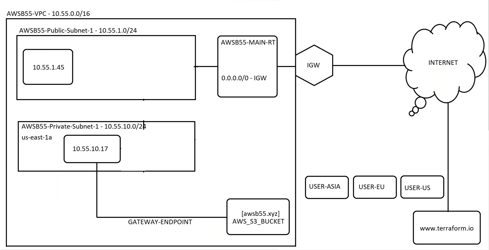
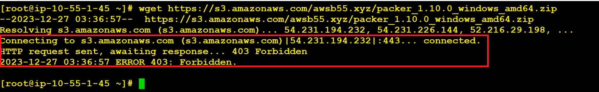
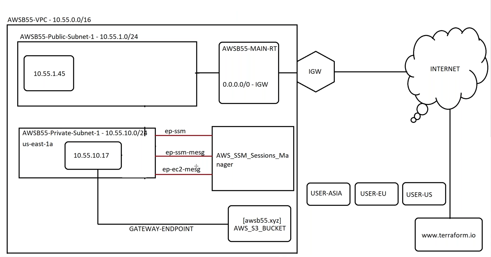

# 📘 **Agenda: VPC Endpoints - Networking & Security**

---

## 📍 **Why Use VPC Endpoints?**
When a private EC2 instance needs to access AWS services like S3, routing that traffic through the **Internet** or a **NAT Gateway** is:
- ❌ Inefficient  
- 🔐 Not Secure  
- 💸 Costly

Using **VPC Endpoints**, we can keep the traffic within the **AWS network**, improving both **security** and **cost efficiency**.

---

## 🌐 **Traditional Access Flow**
Without a VPC Endpoint, the route from a Private EC2 instance to S3 looks like this:

```
Private EC2 ➝ Private Route Table ➝ NAT Gateway ➝ ALB ➝ Public Route Table ➝ IGW ➝ Internet ➝ S3
```

---

## ✅ **Improved Access with VPC Endpoints**
With **VPC Endpoints**, the flow becomes:

```
Private EC2 ➝ Private Route Table ➝ VPC Gateway Endpoint ➝ S3 (within AWS network)
```


---

## 🧪 **Lab 1: Gateway Endpoints (S3, DynamoDB)**

### 🔐 **Why Use Gateway Endpoints**
- Security: Traffic **never leaves** AWS.
- Cost: Avoid **NAT Gateway**, **Internet Bandwidth**, **Data Transfer charges**.

---

### 🔧 **Lab Steps**

1. **Create an S3 Bucket** and upload files (e.g., Terraform files).
2. Try accessing the file via S3 Object URL from browser — it won't work for private resources.
3. Create two EC2 Instances:
   - **Public Subnet:** Amazon Linux (has AWS CLI pre-installed)
   - **Private Subnet:** Ubuntu (attach temporary public IP for setup)

4. On the **private instance**:
   - Install AWS CLI:
     ```bash
     curl "https://s3.amazonaws.com/aws-cli/awscli-bundle.zip" -o "awscli-bundle.zip"
     unzip awscli-bundle.zip
     sudo ./awscli-bundle/install -i /usr/local/aws -b /usr/local/bin/aws
     aws --version
     ```
   - Detach IGW after installing CLI (to make it fully private).

---

### 📌 **Creating Gateway Endpoint**



- Go to **VPC ➝ Endpoints ➝ Create Endpoint**
- Service: `com.amazonaws.<region>.s3`
- Type: **Gateway**
- Attach to Route Table of private subnet
- Policy: **Full Access**

Once created:
- Test file download from **private server** using:
  ```bash
  aws s3 cp s3://your-bucket-name/terraform.zip .
  ```

- Endpoint auto-adds a route in Route Table:
  

---

### 🔐 **IAM Role for EC2 Access**

Instead of using static credentials:

1. Go to **IAM ➝ Roles ➝ Create Role**
   - Use Case: EC2
   - Permissions: `AmazonS3ReadOnlyAccess` or custom S3 policy
   - Attach role to **Private EC2**
2. Reboot EC2 after attaching role.

---

### ❌ Error Handling

- Without IAM or endpoint → ❗ **Access Denied / Forbidden**
- Delete endpoint → ❗ **No Connection**



---

## 🧪 **Lab 2: Interface Endpoints (SSM, EC2 Messages, etc.)**

Used for **AWS Services other than S3/DynamoDB**

### 🔧 **Steps to Create Interface Endpoints**

1. **SSM Endpoint**
   - Service: `com.amazonaws.<region>.ssm`
   - Type: Interface
   - Subnet: Private
   - Attach Security Group

2. **SSM Messages**
   - Service: `com.amazonaws.<region>.ssmmessages`
   - Type: Interface

3. **EC2 Messages**
   - Service: `com.amazonaws.<region>.ec2messages`
   - Type: Interface



---

### ✅ **Benefits of Interface Endpoints**
- Secure internal communication with services like:
  - SSM
  - CloudWatch
  - Secrets Manager
- Enables **SSM Session Manager** access to **private instances**

---

### 🛠️ **SSM Session Manager Access**
If you lose `.pem` or `.ppk`:

1. Go to **Systems Manager ➝ Session Manager**
2. Start a session with **private EC2** (if endpoints & IAM roles are in place)
3. Add new SSH key via:
   ```bash
   echo "ssh-rsa AAAA..." >> ~/.ssh/authorized_keys
   ```


---

### 🔁 Common CLI Commands
- **Download from S3:**
  ```bash
  aws s3 cp s3://your-bucket-name/terraform.zip .
  ```
- **Upload to S3:**
  ```bash
  aws s3 cp terraform.zip s3://your-bucket-name/terraform.zip
  ```

---

## ❓ **Interview Insight**

> **Q:** What if you lose your `.pem` file for a private EC2?

**A:** Use **SSM Session Manager** with **Interface Endpoints** to access the instance securely, generate a new key, and inject it via the session.

---

## 🧠 **Key Takeaways**

- 🔐 **Security First:** VPC Endpoints keep traffic private and inside AWS.
- 💰 **Cost-Efficient:** No NAT gateway/data transfer fees.
- 🔧 **Two Endpoint Types:**
  - Gateway → S3, DynamoDB
  - Interface → All other AWS services
- 🛠️ **System Manager + Endpoints = Rescue Plan** if access is lost.
- ☁️ **Works with External Services** like MongoDB Atlas securely via Interface endpoints.
