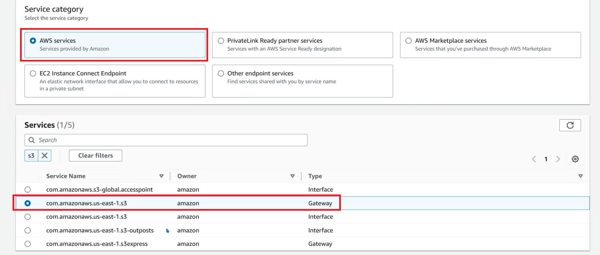

Agenda
---
1. VPC Endpoints - Networking & Security


## Where we can use VPC Endpoints
__Example :__ If we have Private Ec2 Instance supposed to access data from S3 bucket, Currently we are following below Arc.
* If Private server want to get data from S3 bucket currently traffic it flowes in below way
```
Private Server -> Private RT -> NAT GW -> ALB -> Public RT -> IGW -> Internet -> S3
```
* But the above way is not good so, If Private Server want's to get data from s3, we can create VPC Endpoints


## VPC Endpoints Lab
* __Security :__ Why we use VPC Endpoints is Internal data must not be routed over the internet.
* __Cost :__ Cost for NAT, NAT Band Width, S3 Data access over internet.

* There are two types for Endpoints in AWS
    * __Gateway Endpoint :__ S3 and DynamoDB
    * __Interface ENdpoint :__ For all other services


## Steps For Labs - Gateway Endpoint


* Create an S3 Bucket and store data ( EX: Traaform, Images...)
* If you try to access Terraform file which is S3, we con't access it, To try it Click on the terraform file which we had uploaded in S3 and You will see on __Object ID__, Try to access that in any browser
* Create one EC2 Instance in Public Subnet use Amazon Linux
* Create one EC2 Instance in Private Subnet use Ubuntu machine, While creating instance make sure you enable Public IP ( For Temp Purpus )
* Now in Public Subnet since we had installed Amazon Linux, By default AWS CLI will be installed on it
* But in Ec2 instance on Private subnet we had choosed Ubuntu, So we manually install AWS CLI to it
    * For temp purpos attach IGW to Private Subnet so edit RT to attach IGW to Private Subnet, and Login in to it, Since we had enabled Public IP we can login to it, And install AWS CLI


[Refer Here For Official Doc](https://docs.aws.amazon.com/cli/v1/userguide/install-linux.html#install-linux-bundled-sudo)

```
sudo apt update
sudo apt install unzip curl -y

curl "https://awscli.amazonaws.com/awscli-exe-linux-x86_64.zip" -o "awscliv2.zip"

unzip awscliv2.zip

sudo ./aws/install

aws --version
```
* After installing __AWS CLI__ in Private Server, Remove IGW, So now it will become completely Private Server

* __Create Gateway Endpoint__ 



* Select __VPC__ and __Route Tables__ and Policy __Full Access__
* Endpoints, Click on Create Endpoint
* Since we had created Endpoint we cannot download the terraform file from S3, To test this statement follow below process.

---

* Now try to download terraform from public server, You will see below error


* Now to login to Private server using Public Server so we need to import our key to public server, Try to download terraform in private server


* If you delete the Endpoint which we created, You will see below error


---

* When you created Endpoint, You will see one Route added in Route Table, As shown in below

* __Creating Endpoint will make only connection from Private server to S3, But Private server still need permition to download files frmo s3__


---

* Now to Download the terraform file frmo s3, We need credentials 

* We can Get Credentials in Two ways
    * Creating a __access key__ and __secret key__
    * Using a IAM Role for EC2 Machine

* For now we will proceed with __Using a IAM Role for EC2 Machine__
    * To do this, Goto __IAM__, Click on __Roles__. Click on __Create Role__


* Click on __Create Role__

---

* Now Goto Ec2 instance and select the Prive server ans Click on __Actions__ to attach IAM role to EC2 Instance

* Now Reboot the Private Instance, To update IAM role

* Now login to the Private server using Public server, try to download terraform file

To download file from S3
```
aws s3 cp (--S3-URI--) .
```
Below Example for Download files frmo S3
```
aws s3 cp s3://awsendpointsbucket001/terraform_1.12.1_windows_amd64.zip .

aws s3 cp s3://awsendpointsbucket001/terraform_1.12.1_windows_amd64.zip terraform.zip
```

To Upload file from local to S3
```
aws s3 cp terraform.zip s3://bicket-name/terraform.zip
```

## Steps For Labs - Interface Endpoint


* Assign Role which is created in before lab for public server also, We need that permitions for this lab.

* Open __System Manager__ service


* Initially we will see only public servers only, as shown in below


* To create interface endpoint
    * First we need to create __SSM endpoint__
        * GOto endpoints, Click on create endpoint
        * Give __name of the endpoint__
        * Service Category : AWS Services
        * Services : Search for ssm and select __com.amazonaws.us-east-1.ssm__, Type should be __Interface__
        * Select VPC
        * Select Subnets (In our case it is Private Subnet)
        * Select Security Groups
        * Click on __create endpoint__
    
    * Second we need to create __SSM Messages__
        * GOto endpoints, Click on create endpoint
        * Give __name of the endpoint__
        * Service Category : AWS Services
        Services : Search for ssm and select __com.amazonaws.us-east-1.ssmmessages__, Type should be __Interface__
        * Select VPC
        * Select Subnets (In our case it is Private Subnet)
        * Select Security Groups
        * Click on __create endpoint__
    * Third we need to create __Ec2 Messages__
        * GOto endpoints, Click on create endpoint
        * Give __name of the endpoint__
        * Service Category : AWS Services
        Services : Search for ec2 and select __com.amazonaws.us-east-1.ec2messages__, Type should be __Interface__
        * Select VPC
        * Select Subnets (In our case it is Private Subnet)
        * Select Security Groups
        * Click on __create endpoint__

* Reboot the __private server__
* Now goto AWS System Manager and __Start Session__, Now we are able to see Private Servers As Well.
* Now if you loss .pem or .ppk file also you can try use AWS System Managet to add new key and we can login to the machines.

* Using Interface Endpoints we can, not ony conect internally on AWS, We can connect to out side of AWS also, Best Example is conecting to __MongoDB cloud__.


---
### Interview Question ( Explains Why we need to use Interface Endpoints )
#### What if you loss your .pem or .ppk file of your instances which you are running on AWS..?
* To  resolve this, Follow below process
    * We have a service called __AWS System Manager__
    * Goto AWS System Managet under that there will be a __Node Management__, In node management there will be aoption called __Session Manager__, Open that.
    * Click on __Start Session__, If we clearly observe the list of instance which it is showing is related to Public Subnet.
    * You can see that once console will be opened and now you need to generate one .ppk in your local using Puttygen.exe we can do that and copy that Key to __.ssh/authorized_keys__, For reference use below image


* If we see in above solution we are able to do it for only public servers, But to do it for private servers, We need to use __Interface Endpoints__.

---

### Links : 

PuttyGen Download from below link

https://www.chiark.greenend.org.uk/~sgtatham/putty/latest.html