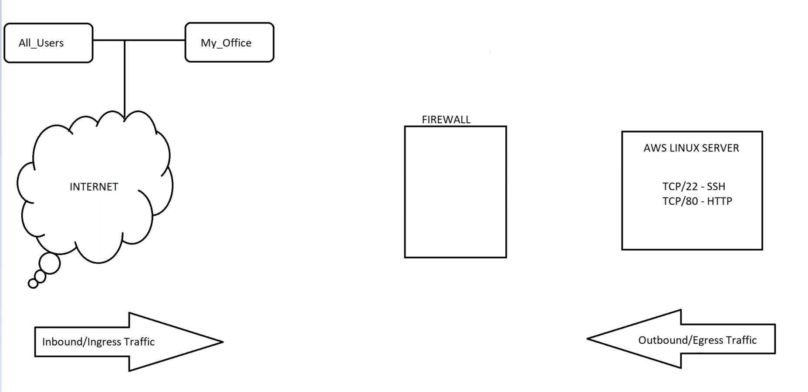

# 🔐 Firewall & Cloud Security Essentials

## 📌 Agenda
1. What is a Firewall?
2. Different Types of Firewalls
3. AWS Security Groups (SG)
4. AWS Network Access Control Lists (NACL)
5. Azure Account Creation

---

## 🔥 What is a Firewall?

A **firewall** is a security system designed to monitor and control incoming and outgoing network traffic based on predetermined security rules. It acts as a barrier between a trusted internal network and untrusted external networks such as the internet.

> ✅ **Purpose**: Restrict unwanted traffic and allow only legitimate communication.

---

## 🚪 Ports Every DevSecOps Engineer / SRE Must Know

In networking, **ports** allow different services or applications to communicate. Each port number corresponds to a specific protocol or service.

| Service            | Port  |
|--------------------|-------|
| SSH                | 22    |
| RDP                | 3389  |
| MySQL              | 3306  |
| MongoDB            | 27017 |
| PostgreSQL         | 5432  |
| MS SQL Server      | 1433  |
| Active Directory   | 389 / 636 |
| HTTP               | 80    |
| HTTPS              | 443   |
| SMB (FSx)          | 445   |
| EFS (NFS)          | 2049  |

> 💡 There are 65,536 ports (0–65535). Each application typically binds to one or more of them.

---

## 🛡️ Different Types of Firewalls

There are **two main types of firewalls** based on traffic state inspection:

### 1. Stateful Firewall
- Keeps track of the state of active connections.
- Only **inbound traffic** rules are needed.
- Automatically allows return traffic.

### 2. Stateless Firewall
- Does **not** track state of connections.
- You must **manually allow both** inbound and outbound traffic.

| Feature        | Stateful Firewall      | Stateless Firewall     |
|----------------|-------------------------|-------------------------|
| Connection Tracking | ✅ Yes                 | ❌ No                  |
| Use Case       | Granular traffic control | Broad network rules     |
| AWS Example    | Security Group (SG)     | Network ACL (NACL)     |

---

## ☁️ AWS Security Groups (SG) – **Stateful Firewall**

> 📌 **Diagram:**  
> 

### Key Points:
- **Default behavior**: Deny all traffic.
- Used at the **instance level** (EC2, Load Balancer, RDS, etc.).
- Can specify **IP ranges** or **another SG** as source.
- One SG can be assigned to **multiple instances**.
- **Return traffic is automatically allowed.**

### 📐 Example: 3-Tier Architecture
> 

### 🧪 Lab:
- ✅ Create a server in a public subnet.
- ✅ Create and associate a Security Group.
- ✅ Allow necessary port traffic (e.g., port 22 for SSH).

---

## 🌐 AWS Network ACL (NACL) – **Stateless Firewall**

> 📌 **Diagram:**  
> 

### Key Points:
- Applied at the **Subnet level**.
- **Default NACL** allows all traffic (in and out).
- Requires **explicit rules for both inbound & outbound**.
- Ideal for **broad traffic control** (e.g., deny IP ranges).
- Automatically created when a **VPC** is created.
- **Subnets are associated** with NACLs by default.

### 🔒 Example Use Case:
- Want to block a malicious IP address across the entire organization?  
  ➜ Add a **DENY rule** in the NACL for that IP under inbound traffic.

---

## ☁️ Azure Account Creation – Quick Start

> 🔧 **Steps to Create an Azure Account:**
1. Go to [https://azure.microsoft.com](https://azure.microsoft.com)
2. Click on **Start free** or **Sign Up**.
3. Sign in using Microsoft account or create one.
4. Provide identity verification (Phone number & Credit/Debit card).
5. Get access to:
   - **$200 in credits** (valid for 30 days)
   - **Free Tier Services for 12 months**

> 💡 Use this Azure account for learning labs, VMs, storage accounts, and virtual networks.

---

## 💡 Additional Tips for DevSecOps / SRE

- 🔍 Always audit **ingress and egress** traffic rules.
- 🧱 Use **least privilege access**: Only open ports that are required.
- 🕵️ Enable **logging** for NACL and VPC Flow Logs to monitor traffic.
- 🔁 Regularly **review and rotate** security rules and credentials.
- 🛠️ Use Infrastructure-as-Code (e.g., Terraform, CloudFormation) to manage firewall rules consistently.

---

## 📘 References
- [AWS Security Groups](https://docs.aws.amazon.com/vpc/latest/userguide/VPC_SecurityGroups.html)
- [AWS Network ACLs](https://docs.aws.amazon.com/vpc/latest/userguide/vpc-network-acls.html)
- [Azure Free Account](https://azure.microsoft.com/en-us/free)

---
