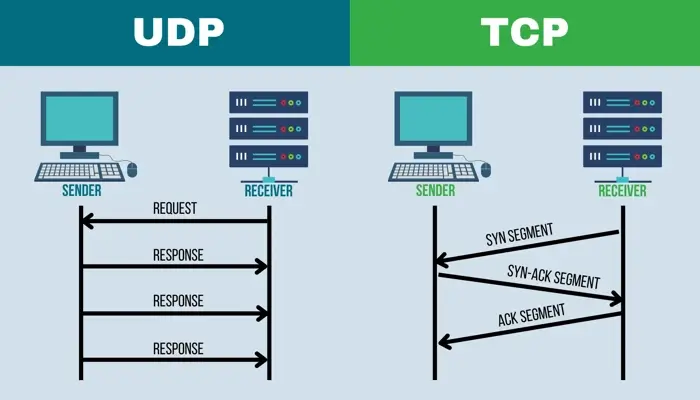
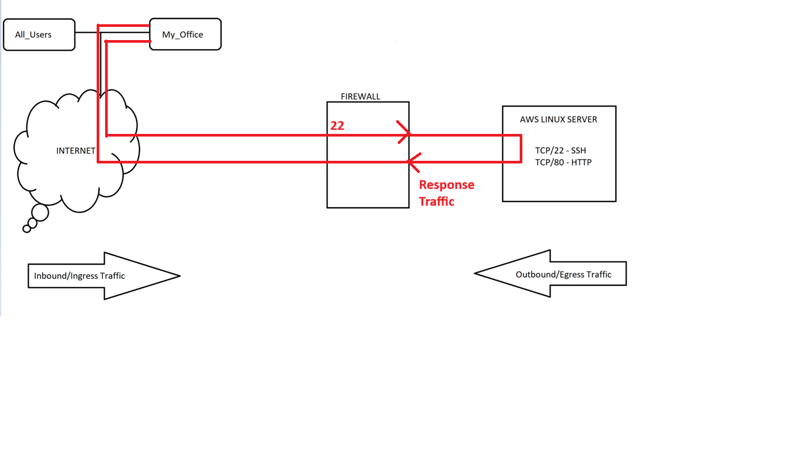
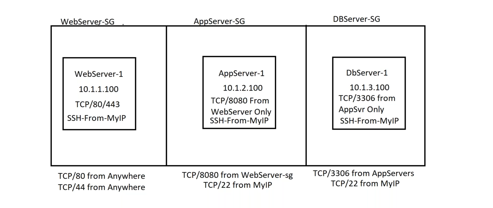

Agenda:
1. What is Firewall
2. Different Types of Firewalls
3. AWS Security Groups ( SG )
4. AWS Network Access Control List ( NACL )
5. Azure Account Creation

---

## What is Firewall
Firewall will restrict the traffic.

* Traffic flows mainly in two was
    * __Transmission Control Protocol ( TCP )__
    * __User Datagram Protocol ( UDP )__

* Firewall will take care of sending traffic and reciving traffic for this ports.

## Ports We must know As a DevSecOps Engineer / SRE
* For each server / Instance we have 0 -> 65535
* For each application we need one port number
* SSH - 22
* RDP - 3389
* MySql - 3306
* MongoDB - 27071
* Postgres - 5432
* MsSql - 1433
* Active Directory (AD) - 389 / 636
* HTTP - 80
* HTTPS - 443
* SMB (FSx) - 445
* EFS (NFS) - 2049

__NOTE : Above ports are not fixed, If we want, We can change ports also__

## Different Types of Firewalls
* There are two types of Firewall's
    * Statefull Firewall
    * Stateless Firewall

* __Statefull Firewall :__ For Statefull Firewall, No need of opening the ports for responce traffic.

* __Stateless Firewall :__ For Stateless Firewall, Both sides traffic should be allowed. 

* In AWS __Security Group__ is __Statefull Firewall__
* And __AWS Network Access Control List ( NACL )__ is __Stateless Firewall__

## AWS Security Groups ( SG ) - Statefull

* Security Group by default deny all the traffic, So if we want to traffic should be allowed from some port we can allow that
* Applied to all resources except to Subnets
* Source can be IP Range or Security Group
* One Security Security Group can be attached to one or more servers

* Below is the example of SG Usage in Three Tire Arc

### Lab
* Create One server in public subnet
* Create one Security Group
* Done

## AWS Network Access Control List ( NACL ) - Stateless

* Here in NACL which follows State less, We need to allow inbound and outbound traffic manually 
* Its only applicable for Subnets
* Default NACL & SG is created while creating VPC Creation.
* All subnets are default uses NACL.
* Good for controlling traffic as whole VPC.
* We don't make changes to NACL Frequently.
* __Example Use-case :__ If we want to block any IP organization level we can simple edit inboud rules of NACL and make that ip traffic deny

## IMPORTANT Azure Account Creation

## Interview Questions

**Q: I have a MySQL database. I want to block access to it using a Security Group (SG). How can I do that?**

**A:** In AWS, Security Groups are stateful and work on a default deny-all policy. This means all inbound traffic is blocked unless you explicitly allow it by adding rules. So, to block access to your MySQL database, simply **do not add any inbound rule** for port 3306 (the default MySQL port). No need to explicitly "deny" traffic—just don't allow it.
