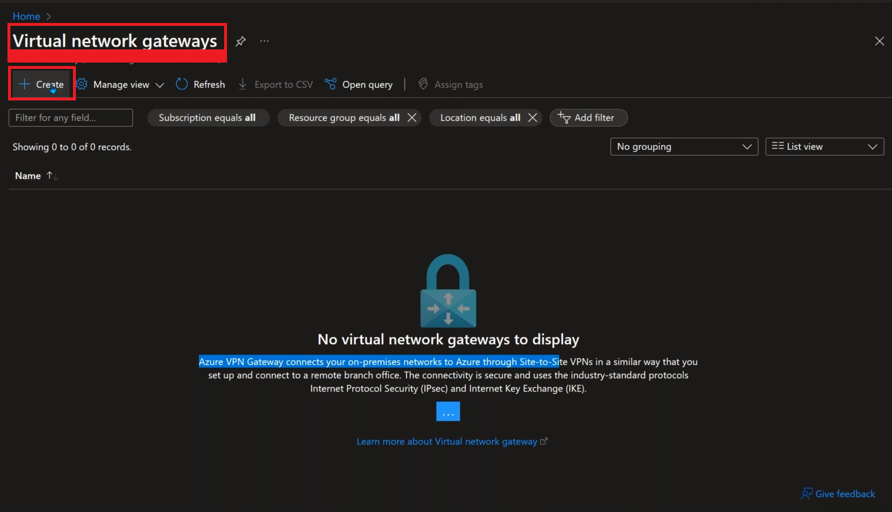
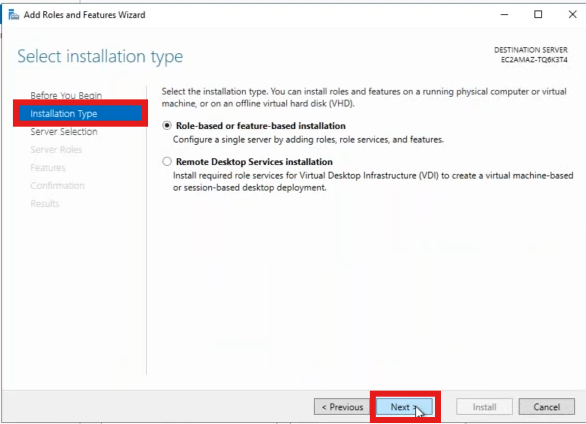

Agenda:
1. Virtual Private Network (VPN) from AWS to Azure

## Setup in Azure
* Login to Azure, And create Virtual Network ( VN ), Below are the steps to create Virtual Network


* Now open the Virtual Network and Goto Subnets onit, Click on Gateway Subnet to create Virtual Network Gateway ( VNG )


* Now Goto Virtual Network Gateway ( VNG ) Service




```
NOTE : It will take 18 to 30 Min to create VNG
```

## Lab to establish connection from AWS to Azure


* Now here, we need to add Azure server to AWS AD Server Private table, And If we create some users in AWS AD Server, And using that users if we login to Azure AD Server Authentication should be done in AWS AD Server, End off the day we need to connect privately.

### Create Azure AD Server
* Follow below images to create Win VM.


### Install Azure AD in the Server

* Login to VM
* Disable Firewall using ``firewall.cpl``
* Try to ping AWS AD Server using private IP of it, from Azure Server, It wont work.
* Try to ping Azure AD Server using Private IP of it, from AWS Server, It wont work.
* Change ```DNS Server```, It should be ```IPv4 Address```, Follow below images to do it in Azure


* Allow All Traffic


* Reboot the Azure AD Server


### To know about AWS to Azure

* Follow below images to tell about AWS Site-to-site VPN to Azure


To get IP Address for About images, You can get it from AWS, As shown in below


--------------
CONTINUE
--------------

## Install Active Directory in AWS Servers
* Login to the Win Server ( Connect using RDP )
* Open PowerShell using Administrator access
    * give ``ipconfig /all``


* TO install Active Directory ( AD ), We need to keep __DNS Server__ as same as __IPv4 Address__

* Enter ``ncpa.cpl``


* Right click on ``Eathernet 2``, Click on ``Properties``


* Select ``Internet Protocol Version 4(TCP/IPv4)`` and click on ``Properties``


* __NOTE :__ Disable Firewall, Use below CMD ``firewall.cpl``, If we enable firewall by default pind wont work, Firewall dont allow ping, So disable firewall for testing.


* Open Server Manager, To install AD





> __NOTE :__ It will install and Server will be automatically reboot

* After Reboot, Try to login as shown in below
* After Reboot, Try to Disable Firewall again because we had assigned server to domain.


* TO Verify, AD is installed or not
    * Open CMD with Admin access and enter ``dsa.msc``, You will see the AD with users as shown in below


### Create Users in AWS AD Server


* Now Copy the Anand user and create another user


### Create VPG in AWS
* Goto __VPC__, Select __Virtual Private Gateway__ under __Virtual Private Network (VPN)__
* Follow Below Steps


* Attach VPG to VPC ( VPC which AWS AD Server was created )


* Edit the Route Table, Which is associated with our AWS AD Server


* Now to know AWS VPG and Azure VNG each other we need the public IP's which was associated with each other

* To Know AWS VPG about Azure VNG, Take public IP of Azure VNG and Goto AWS VPC
    * Goto __Customer Gateway__ on __Virtual Private Network__
    * Click on __Create Customer Gateway__


### Configure VPN in AWS
* Goto VPC, Under __Virtual Private Network__, Select __Site-to-Site-VPN Connections__ 


* Click on __Create VPN Connection__


## Our Gole


When we try to RDP to Azure AD Server, using Anand user creds, Authentication needs to be done by AWS AD Server, Privately using VPN.

## What If we have More than one VPC's in AWS 
* Then we need to make conection as shown in the image


```
BUT THIS IS NOT RECOMENDED WAY, TO SOLVE ABOVE PROBLEM WE CAN USE TRANSIT GATEWAY
```