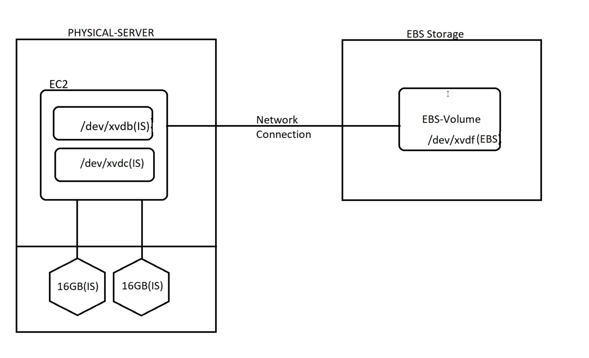

Agenda:
-------
1. Types of EC2 Instances
2. Instance Metadata
3. Types of Storages in AWS
4. EBS Volumes usecase

## Types of EC2 Instances

### On-Demand Instances

These are instances which we daily use ( And which we are using currently in labs )

* On-Demand instances are billed based ob __Hourly Basis__

* To verify instance is on-demand or not check __Lifecycle__ it should be __Normal__


### Spot Instances

AWS will provide Spot Instance for cheap cost, But if requirement for On-Demand is more AWS will stop the instance or Romove them 

* To verify instance is Spot Instances or not check __Lifecycle__ it should be __Spot__

### Reserved Instances

* We can Reserve the instances for 1-year or 3-years, So that we can get discount from AWS, So we can save money

* Applicable for EC2 instances only and cost will be dependends on Region & AZ

### Savings Plan

* Here we are commiting that we will make 10$ for every 1 hour, According to that AWS will give discounts 

## Instance Types

[AWS Instance Types](https://aws.amazon.com/ec2/instance-types/)


## Types of Storages in AWS

### Elastic Block Storage
Block storage for EC2 instaces
### Instance Storage
Temporary volumes provided by AWS for specific instance Types


### Elastic File System
Shared file system (NFS) for Linux

### Shared File System
FSx  for Windows Servers

### Object Storage
Simple Storage Service ( S3 )

## Lab to understand Instance Storage



* Create a EC2 instance with below details
    * AMI : ubuntu
    * Instance Type : C3.large
    * Subnet : Public
    * Enable Public IP : Yes
    * IAM instance profile : Admin access
    * Detailed CloudWatch monitoring : Enable
    * Metadata version : V1 and V2 (token optional)
    * Allow tags in metadata : Enable
    * User data : [V1-Game](https://github.com/Thoyaz/AWS_Notes/blob/master/Scripts/v1-Game.sh)

* Login to Server
    * To check Blocks use `lsblk`
    * To check UUID of Blocks use `blkid`
    * To formate Block use `fdisk <disk-path>`


* If we check Blocks now one partition will be created, As shown in below


* To unmount block, follow below process, We will take example as `xvdb` to learn unmount


* Now formate `xvdb` so that we it can create partition


* Now Create an EBS Volume and attach it to our Linux Server, To Do that follow below images

* Make sure you are creating Volume at same region as Our Linux Machine region


* To Attach volume to EC2


* Formate EBS Volume


* Now create file system, To create file system take below image as example


* Now we need to mount volumes, to do that follow below process

* Create 1 Folder for 2GB Volume


* Another way to mount, Here we are mounting to instance Storage


* Now Keep some files in EBS Volume, Which is 2GB


* Now copy files from /2gbvolume folder to /xvdc1


* Now if you reboot the system files will be there in both EBS and Instance Storage Volumes
* But if you Stop the instance and Start it again we lose the data which is present in Instance Storage

### New CMD'S
```bash
sudo mkfs -t ext4 /dev/xvdf

sudo mkdir /mnt/data

sudo mount /dev/xvdf /mnt/data

sudo blkid /dev/xvdf

sudo nano /etc/fstab

Example :

UUID=abcd-1234  /mnt/data  ext4  defaults,nofail  0  2

sudo mount -a

df -h
```

### Disadvantages of Instance Storage
* It is for Temp storage
* Available for selected machine types
* Cannot increase or decrease the storage
* Cannot change Storage Type

## Instance Metadata

* To check instance metadata, follow below steps


* If we want to stop exposing our instance metadata, Follow below process


* Now if you try to access meta-data, We cannot access it


