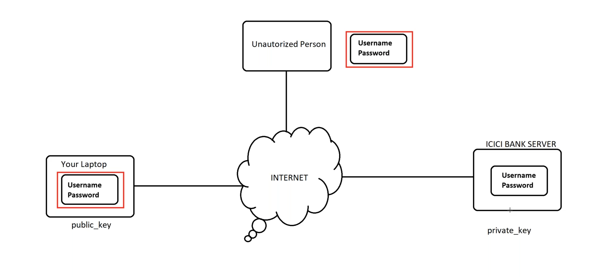
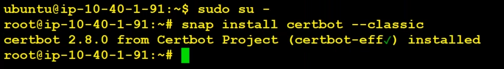

## Agenda
* Understanding SSL/TLS Certificates
* Generate SSL certificates using certbot.
* Generatng SSL using AWS Certificate Managher
* Importing Certiicates
* Installing certs on nginx using certbot

Secured Socket Layer(SSL) ==> OLD \
Transport Layer Security(TLS) ==> NEW
SSL/TLS Certificates ==> Security and Data Encryption
### Why we need to use SSL/TLS Certificates


* There are two types of encryption
    * symmetric
    * asymmetric

__Symmetric :__ Use same key for Encryption and Decryption
__Asymmetric :__ Use different keys Encryption and Decryption

### How Does SSL/TLS Encryption Work?
[Referece Link](https://www.f5.com/glossary/ssl-tls-encryption)

SSL/TLS uses both asymmetric and symmetric encryption to protect the confidentiality and integrity of data-in-transit. Asymmetric encryption is used to establish a secure session between a client and a server, and symmetric encryption is used to exchange data within the secured session. 

A website must have an SSL/TLS certificate for their web server/domain name to use SSL/TLS encryption. Once installed, the certificate enables the client and server to securely negotiate the level of encryption in the following steps:

* The client contacts the server using a secure URL (HTTPS…).
* The server sends the client its certificate and public key.
* The client verifies this with a Trusted Root Certification Authority to ensure the certificate is legitimate.
* The client and server negotiate the strongest type of encryption that each can support.
* The client encrypts a session (secret) key with the server’s public key, and sends it back to the server.
* The server decrypts the client communication with its private key, and the session is established.
* The session key (symmetric encryption) is now used to encrypt and decrypt data transmitted between the client and server.

Both the client and server are now using HTTPS (SSL/TLS + HTTP) for their communication. Web browsers validate this with a lock icon in the browser address bar. HTTPS functions over Port 443.

Once you leave the website, those keys are discarded. On your next visit, a new handshake is negotiated, and a new set of keys are generated.

* To verify the web site is trusted or not, there one service in windows machine which is __MMC__

## Lab
We can generate SSL/TLS certificates using __AWS Certificate Manager (ACM)__ 

OR

To get SSL / TLS certificates we use \
__LetsEncript__ for free SSL certificate \
__CertBot__ for generating SSL Certs 

* Create EC2 Server
* Install __Certbot__
```bash
snap install certbot --classic
```
__Result :__



* CMD's to generate certs using certbot
```bash
certbot certonly --manual --preferred-challenges=dns --email thugsofmpl@gmail.com --key-type rsa \
--server https://acme-v02.api.letsencrypt.org/directory --agree-tos -d *.tzpc.xyz

certbot certonly --manual --preferred-challenges=dns --email thugsofmpl@gmail.com --key-type rsa \
--server https://acme-v02.api.letsencrypt.org/directory --agree-tos -d tzpc.xyz
```

* To use this certificates for our server, use below CMD
```bash
certbot --nginx
```