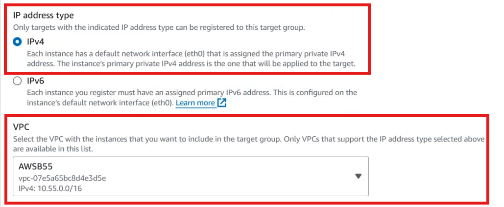
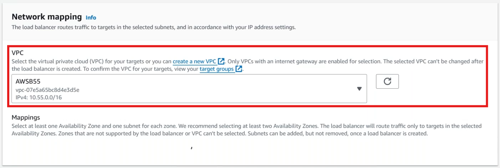

0. OSI Layers
1. Types of Load Balancers
    - VPC Based or Region based Load Balancer
        1. Network Load Balancer - TCP/UDP - Layer 4 LB.
        2. Application Load Balaner - Later 7 LB
        3. Classic Load Balancer
        4. Gatway Load Balancer

    - Global Load Balancer
        1. Route53 Routing Policies
        2. Global Accelerator
2. Deploying Network Load Balancer(NLB)
3. Configuring http & https.

## OSI Layers

## Network Load Balancer
* Create VPC, with 3 public subnet's
* Create three EC2 Servers on Public Subnet (Just for learning NLB)
* First, Now create Target Group

* Now create Load Balencer

__NOTE :__ It will take time to create LB

* Now add Routes in ROute 53
    * Go to your domain
    * Routing Policy : simple routing
    * Click on Define a simple ROuting
    * Record Name : www.tzpc.xyz
    * Record Type : A
    * Value/Route Traffic to : Alias to Network Load Balencer
    * Region : us-east-1
    * Select Our LB
    * Create Record

* For LB, We can attach More than 1 Target Groups, Below is the Example
    * Create one TG

* Now attach TG to LB

* Enable Logging on LB, As shown in below
* Create S3 Bucket
    * While creating uncheck __Block All Public Access__
* Go to Bucket Permitions
    * Click on Edit Bucket Policy, Past the json which i provided in __Scripts__

 
 

### Things not possible in NLB:
1. HTTP to HTTPS Redirection.
2. URL/Path Based Routing
3. Blue/Green or Canary Based Deployment.
4. Integration with Web Application Firewall(WAF)

### Delete Lab
* Delete NLB
* Delete EC2 Servers
* Delete Target Groups
* Delete S3
* Delete VPC

### Interview Question
__Differnece between NLB and ALB__ \
NLB, Which supports both TCP and UDP, But NLB has more strength for UDP protocols
NLB Does not Support HTTPS redirection

__TDP VS UDP__
 