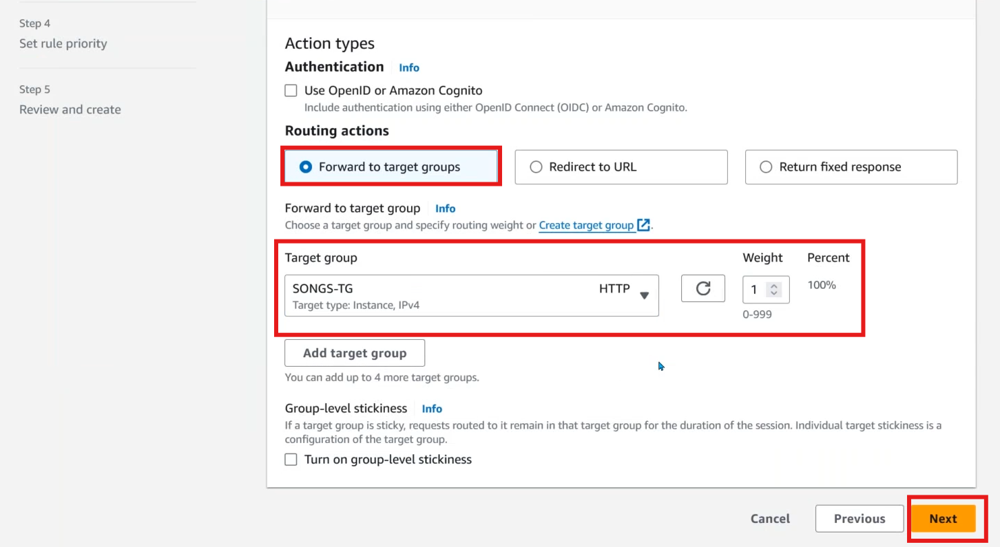
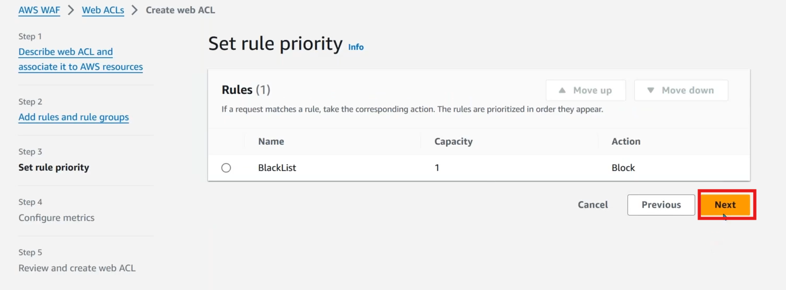
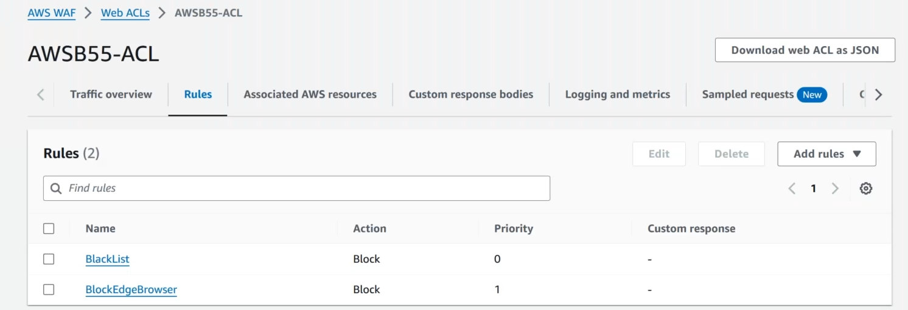

* Application Load Balencer (ALB)
    * HTTP to HTTPS redirection
    * path/url based routing
    * Blue/Green or Canary Based Deployments
* Web Application Firewall (WAF)

## Lab for Application Load Balencer (ALB)

* Create VPC 
* Create 4 servers
    * Home-Page-1
    * Home-Page-2
    * Songs-Page
    * Movies-Page

## Gole

### Path Based Routing
* Now our gole is, If we hit https://public-ip/movies/, It should route to movies OR If we hit https://public-ip/songs/, It should route to songs, This is called as path based routing

* Now if you try to access

* Now Create Target Groups
    * Create Home page TG
        * Choose Target Type : Instences
        * Target Group Name : HomePage-TG
        * Protocol AND Port: HTTP/80
        * IP address type : HTTP
        * Select VPC
        * Health Check : HTTP
        * next
        * Available Instances, Select Only HomePage Instances
        * Create TG
    * Create Movies TG
        * Choose Target Type : Instences
        * Target Group Name : Movies-TG
        * Protocol AND Port: HTTP/80
        * IP address type : HTTP
        * Select VPC
        * Health Check : HTTP
        * next
        * Available Instances, Select Only Movies Instances
        * Create TG
    * Create Songs TG
        * Choose Target Type : Instences
        * Target Group Name : Songs-TG
        * Protocol AND Port: HTTP/80
        * IP address type : HTTP
        * Select VPC
        * Health Check : HTTP
        * next
        * Available Instances, Select Only Songs Instances
        * Create TG

* Create ALB
    * LB Name : AWS-ALB
    * Scheme : Internet-facing
    * Select VPC
    * Select Mappings ( Select Public Subnets only )
    * Select SG
    * Listeners and Routing
        * HTTPS/443, Select TG (HomePage-TG)
    * Default SSL/TLS server certificate
        * Certificate Source
            * From ACM (Select AWS provided certificate)
    * Create LB
    * IT WILL TAKE TIME, TO CREATE

* Adding Listeners To ALB
    * Click on Add Listener
    * Listener configuration
        * HTTP/80
    * Default Action : Redirect to URL
        * Full URL : 
        * Click ADD

* Enable Monitoring
    * Create S3 bucket
    * Goto LB and on Attributes enable Monitoring

* Add Routes in Route53
    * create wild card record
        * Record Name : www.tzpcsystems.xyz
        * Record Type : A
        * Turn ON Alias
        * Route Traffic To : Alias to ALB
        * Choose Region : us-east-1
        * Select ALB
        * Save
    * Create naked record
        * Record Name : KEEP BLANK
        * Record Type : A
        * Route Traffic To : Alias to ALB
        * Choose Region : us-east-1
        * Select ALB
        * Save

### Now Test our Lab
* Try to access http://tzpcsystems.xyz, It should redirect to https://tzpcsystems.xyz
* Try to access http://www.tzpcsystems.xyz, It should redirect to https://www.tzpcsystems.xyz

* But if you try to access tzpcsystems.xyz/movies/ or tzpcsystems.xyz/songs/ you will get below error

* To do path based routing, We need to add Listeners and rules for ALB
* Add Path based routing for Movies

* Add Path based routing for Movies

* Add Path based routing for Songs 

* If you try to access tzpcsystems.xyz/movies/ or tzpcsystems.xyz/songs/ It will work

### Blue/Green

* Create New Server which is HomePage-NewVersion
* Create New TG, To test this
    * Choose Target Type : Instences
    * Target Group Name : NewVersion-TG
    * Protocol AND Port: HTTP/80
    * IP address type : HTTP
    * Select VPC
    * Health Check : HTTP
    * next
    * Available Instances, Select Only NewVersio Instances
    * Create TG

* Now add that to ALB

### Canary Based Deployments

## Web Application Firewall (WAF)
* WAF will provide additional layer of protection for the applications
### If you want to block IP's
* First create __IP set__

* Under IP Addresses, Prove IP's which you want to block \
__EX : 123.12.12.1/32__
* Now create __Web ACL(Access Control List)__

### If you want to block Browser's Like Microsoft Edge

### What if Blocked IP people will use VPN to access our website

* Remove Block IP List, To test more

### What if people hitting your website frequently, Or They are running scripts to down our application

## AWS Shield
* To Stop DSoS Attacks aws will provide a service called AWS Shield